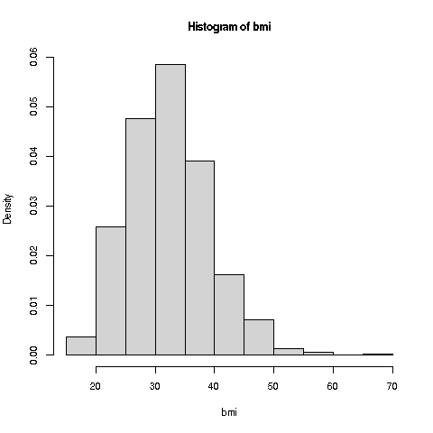
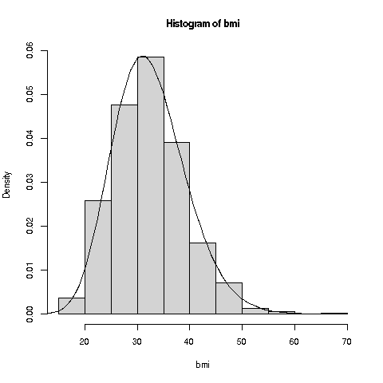
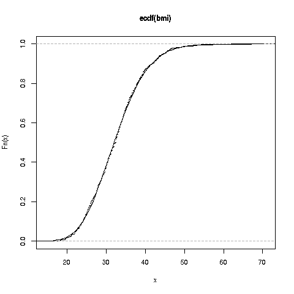

#  Fitting Continuous Parametric Distriibutions

Say one has some data and wishes to find a parametric distribution family.
We address two questions here:

* Why is this desirable?

* How might it be done?

## Why fit a parametric distribution?

Many statistical and probability models assume there are some parametric
distributions driving the various variables.  Even in more basic
settings, having a parametric model for our data allows us to compactly
describe our data, with a small number of parameters sufficing.

## How can the fitting be done?

In statistics, we treat our data as a sample from a parent population,
in which the variable of interest, say X, has unknown density
f<sub>X</sub>(t).  We estimate that density from our data.

### Running example:  Pima diabetes data

This is a widely-used dataset, available for instance from the **mlbench**
package:

``` r
> library(mlbench)
> data(PimaIndiansDiabetes2)
> pima <- PimaIndiansDiabetes2
> head(pima)
  pregnant glucose pressure triceps insulin mass pedigree age diabetes
1        6     148       72      35      NA 33.6    0.627  50      pos
2        1      85       66      29      NA 26.6    0.351  31      neg
3        8     183       64      NA      NA 23.3    0.672  32      pos
4        1      89       66      23      94 28.1    0.167  21      neg
5        0     137       40      35     168 43.1    2.288  33      pos
6        5     116       74      NA      NA 25.6    0.201  30      neg
> bmi <- pima$mass
> bmi <- na.exclude(bmi)
```
### Visual inspection

So, let's plot the data.  We'll use R's basic histogram function,
**hist()**.  A more advanced alternative is **density()**, which plots a
smooth curve.  In calling **hist(bmi,freqs=FALSE)** (that second
argument means we want area = 1.0), we produce this:



Remember, this is a sample estimate of f<sub>X</sub>, so it can be used
for deciding whether to use a given parametric model.

We see a rather steep rise from 0, quickly reaching a peak, then a
gradual tapering off toward 0.  This suggests that the gamma
distribution family may work well.

There is of course the question as to how *well* this data is fit by the
gamma family.  We will return to this later.

### Estimating parameter values

Once we decide to use a certain parametric family, we must decide which
*member* of that family to use. In other words, what parameter values?

The two classic ways to estimate the parameters are Maximum Likelihood
Estimation (MLE) and the Method of Moments (MM).  I'm partial to MM,
and will use that here.

The population k<sup>th</sup> moment of X is defined to be
E(X<sup>k</sup>).  It can be estimated by its sample analog

(1/n) &Sigma;<sub>i=1</sub><sup>n</sup> X<sub>i</sub><sup>k</sup>

where our data are X<sub>1</sub>,...,X<sub>n</sub>.

The idea of MM is to set the population moments equal to their sample
analogs.  Since the former are functions of the parameters, we can solve
for the parameters, which serve actually as our estimated parameters.

If we have m parameters, we form equations corresponding to the first m
moments.  For the gamma family with paraemeters r and &lambda;, we use
the first two moments.  For convenience, we'll use variance ("second
central moment'') rather than E(X<sup>2</sup>); either one will work.

For the gamma family, EX = r/&lambda; and Var(X) = r/&lambda;<sup>2</sup>.
Then with the sample mean G ("X-bar" doesn't render well in Markdown on
some machines)
and s<sup>2</sup>, we set
r/&lambda; = G
and
r/&lambda;<sup>2</sup> = s<sup>2</sup>.
Solving, we find that our estimates of r and &lambda; are
<SPAN STYLE="text-decoration:overline">X</SPAN><sup>2</sup> / s<sup>2</sup>
and
<SPAN STYLE="text-decoration:overline">X</SPAN> / s<sup>2</sup>.

Let's superimpose the fitted gamma density onto the histogram:



Seems to be working.  Let's try comparing CDFs.  Just as a histogram is
a model-free estimate of f<sub>X</sub>, a model-free estimate of
F<sub>X</sub> is the *empirical CDF*:

F&#770;(t) = proportion of X<sub>i</sub> that are &leq; t.

The R function **ecdf** computes this and sets it up for plotting.
(Actually, **ecdf** returns a function of class **'ecdf**, so calling
**plot()** on the return value invokes **plot.ecdf()**.) Let's go ahead:

``` r
> plot(ecdf(bmi),pch=19,cex=0.1) 
> curve(pgamma(x,ch,lh),0,70,add=TRUE) 
```



The ECDF and the fitted CDF are almost identical, wonderful.  We were
lucky here; in most real applications, we do not achieve such a close
fit, even though the fit is usable.

### Assessing fit

Well then, how well did our gamma model fit?

First, note that there are several possible sources of discrepancies between
the histogram and the fitted gamma:

* The true f<sub>X</sub> is not gamma.  No model is ever perfectly
  right.  Keep in mind the famous George Box quote, "All models are
false, but some are useful."

* We have just a sample of values from the population, so even if our
  gamma model were exactly correct for the true f<sub>X</sub>, our
sample estimate would not form a perfect match. The larger the sample,
the more likely we will have a close fit, but never exact.

* Again due to our finite sample, we have nonzero widths for the
  histogram intervals.

So, assessing fit is a matter of attempting to decide how much of the
discrepancy is due to having a finite sample, and how much is due to
model error.

There are formal methods of assessment, known as *goodness of fit
tests*, but these days hypothesis testing and p-values are frowned upon
for any type of statistical situation, for good reason.  Testing is
especially irrelevant in assessing model fit.  They don't tell us
whether our fit is "good enough" for our purposes.

If you feel you must do formal assessment, I suggest forming a
*Kolmogorov-Smirnov confidence band*.  We will not pursue that here.

